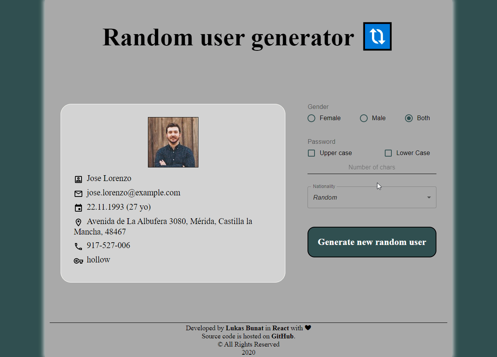

# Random user generator

## Description
Simple webapp that generate random user info that fetches from [random user API](https://randomuser.me/documentation) and displays it on its own UX. The user can specify parameters which will be used while generationing the user info.

## Live demo link
Hosted on [www.user-generator.techis.fun](https://user-generator.techis.fun) with [Vercel](https://vercel.com/)

## Demo

## Technologies
- [React 16.8+](https://reactjs.org/)
- [Typescript](https://www.typescriptlang.org/)
- [SCSS](https://sass-lang.com/)
- [Material UI](https://material-ui.com/)

## Licence
MIT